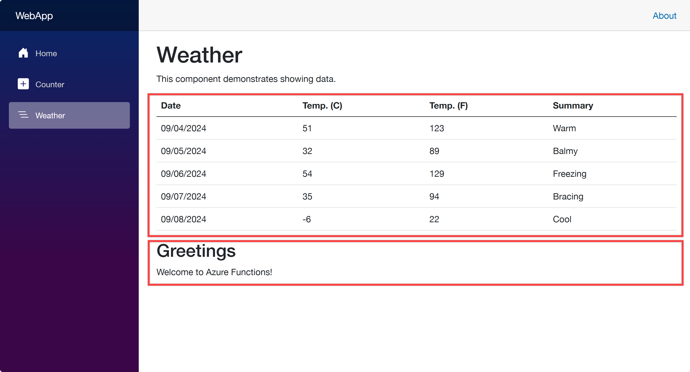

# azdevfying .NET apps on Azure Container Apps

This provides sample .NET apps to be deployed onto Azure Container Apps through [Azure Developer CLI](https://learn.microsoft.com/azure/developer/azure-developer-cli/install-azd?WT.mc_id=dotnet-149302-juyoo).

## Prerequisites

- [Visual Studio 2022 17.10+](https://visualstudio.microsoft.com/vs/?WT.mc_id=dotnet-149302-juyoo) or [Visual Studio Code](https://code.visualstudio.com/?WT.mc_id=dotnet-149302-juyoo) with [C# Dev Kit](https://marketplace.visualstudio.com/items?itemName=ms-dotnettools.csdevkit&WT.mc_id=dotnet-149302-juyoo)
- [Azure Developer CLI](https://learn.microsoft.com/azure/developer/azure-developer-cli/install-azd?WT.mc_id=dotnet-149302-juyoo)
- [Azure Functions Core Tools](https://learn.microsoft.com/azure/azure-functions/functions-run-local?WT.mc_id=dotnet-149302-juyoo)
- [Docker Desktop](https://docs.docker.com/desktop/)

## Architecture


Three .NET apps are provided in this repository:

- [Blazor web app](./WebApp/) as a frontend
- [ASP.NET Core Web API](./ApiApp/) as a backend
- [Azure Functions](./FuncApp/) as a backend

## Getting Started

1. Login to Azure through Azure Developer CLI.

    ```bash
    azd auth login
    ```

1. Run the following command to initialise `azd`. It will ask you to choose options how to initialise. Follow the instructions.

    ```bash
    azd init
    ```

   Once initialised, you will have both `.azure` and `infra` directories and both `next-steps.md` and `azure.yaml` files.

   At this stage, the web app doesn't know where the API and Functions apps are. Therefore, you need to update the `main.bicep` file to pass the API and Functions app URLs to the web app.

1. Open `infra/main.bicep` file and update the following section:

    ```bicep
    module webApp './app/WebApp.bicep' = {
      name: 'WebApp'
      params: {
        ...
    
        // Add the following two lines
        apiEndpointUrl: apiApp.outputs.uri
        funcEndpointUrl: funcApp.outputs.uri
      }
      scope: rg
    }
    ```

1. Open `infra/app/WebApp.bicep` file and add the parameters:

    ```bicep
    ...
    @secure()
    param appDefinition object
    
    // Add the following two lines
    param apiEndpointUrl string
    param funcEndpointUrl string
    ...
    ```

1. Update the `env` variable:

    ```bicep
    // Before
    var env = map(filter(appSettingsArray, i => i.?secret == null), i => {
      name: i.name
      value: i.value
    })
    
    // After
    var env = union(map(filter(appSettingsArray, i => i.?secret == null), i => {
      name: i.name
      value: i.value
    }), [
      {
        name: 'API_ENDPOINT_URL'
        value: apiEndpointUrl
      }
      {
        name: 'FUNC_ENDPOINT_URL'
        value: funcEndpointUrl
      }
    ])
    ```

1. Run the following command to provision and deploy all the apps to Azure Container Apps.

    ```bash
    azd up
    ```

1. Once the deployment is completed, you will see the output like below:

    ```bash
    Deploying services (azd deploy)
    
      (✓) Done: Deploying service ApiApp
      - Endpoint: https://ca-apiapp-{{random-string}}.{{random-string}}.{{location}}.azurecontainerapps.io/
    
      (✓) Done: Deploying service FuncApp
      - Endpoint: https://ca-funcapp-{{random-string}}.{{random-string}}.{{location}}.azurecontainerapps.io/
    
      (✓) Done: Deploying service WebApp
      - Endpoint: https://ca-webapp-{{random-string}}.{{random-string}}.{{location}}.azurecontainerapps.io/
    ```

1. Click the web app URL above to see the deployed web app, and navigate to the `/weather` page. Then you will see the screen like below:

    

   The weather data is fetched from the ASP.NET Core Web API while the greetings message is fetched from the Azure Functions.

## More Information

- [Azure Container Apps](https://learn.microsoft.com/azure/container-apps/overview?WT.mc_id=dotnet-149302-juyoo)
